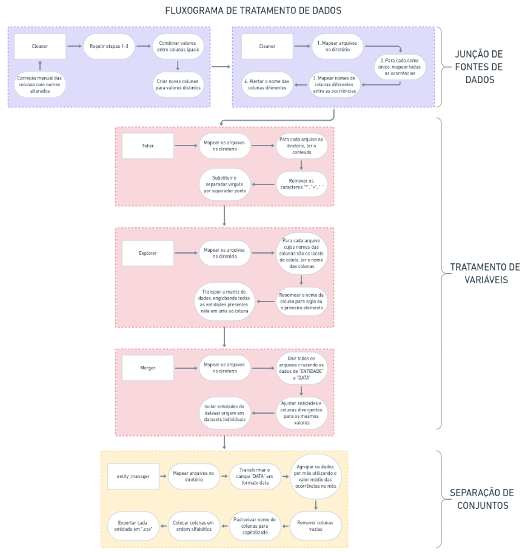
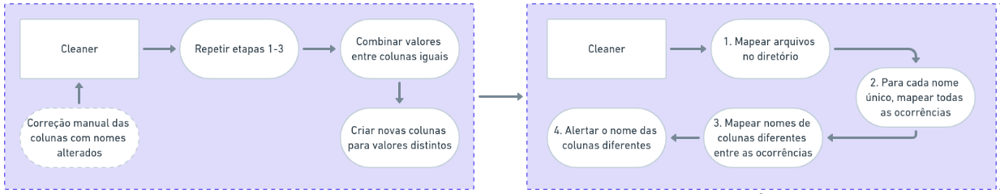
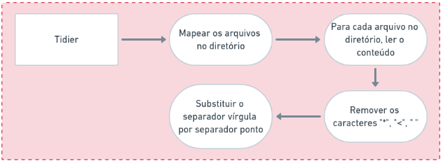
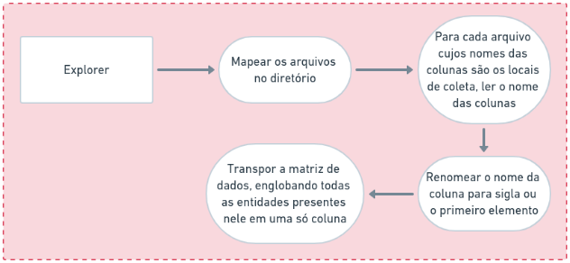
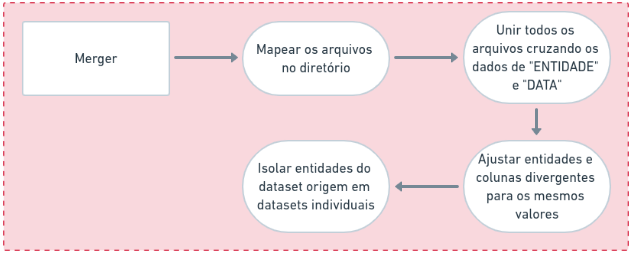
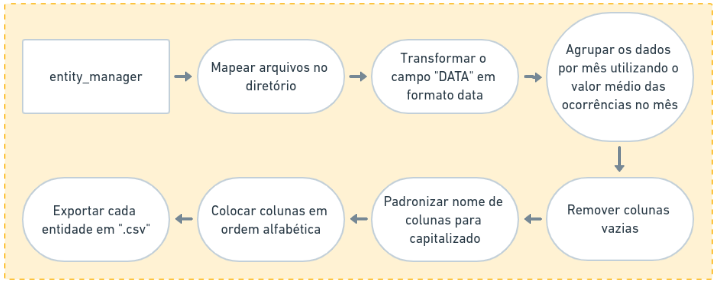

<h2 style="text-align: left">

[« Anterior](https://github.com/vcwild/wtp-extract) | [Apresentação](#ovr) | [Procedimento](#proc) | [Próxima »](https://github.com/vcwild/wtp-eda)

</h2>

## Etapa Anterior

- [Extração de Dados](https://github.com/vcwild/wtp-extract)

## Próximas Etapas

- [Análise Exploratória](https://github.com/vcwild/wtp-eda)
- [Modelagem de Séries Temporais](https://github.com/vcwild/wtp-model)

# Apresentação <a name="ovr">

## Tratamento de Dados

Para permitir interpretação e manipulação dos dados será necessário primeiro agrupá-los de forma coesa e torná-los inteligíveis aos métodos computacionais de representação e processamento da fase de exploração de dados.

## Etapas

O processo de tratamento de dados envolveu um pipeline com diversas etapas para filtrar e processar os dados de acordo com o local de análise, formato, dimensão, grau de normalização, diversificação de nomes e unidades de mensuração utilizados ao longo do tempo.

O resumo do pipeline de processamento pode ser verificado conforme o fluxograma:

A especificação de cada etapa está descrita em detalhes no tópico de procedimento.

# Procedimento <a name="proc">

- [Junção de Fontes de Dados](#join)
- [Tratamento de Variáveis](#var)
  - [Limpeza de Caracteres Especiais](#schar)
  - [Renomeação de Entidades e Normalização de Dados](#rename)
  - [Unificação de Datasets](#unite)
- [Padronização de Conjuntos](#std)

## Junção de Fontes de Dados <a name="join">

Nessa etapa, foi realizada a concordância dos nomes dos parâmetros entre as tabelas anuais que possuem os mesmos rótulos e dados mas cujos títulos foram modificados. O objetivo do procedimento é realizar a união das ocorrências anuais de dados desde o início ao final do período de coleta, conforme aponta o fluxograma:

O procedimento foi dividido em duas rotinas, com intervenção após a primeira (elemento pontilhado) para definir manualmente as colunas a serem renomeadas em cada caso.  
Cada série de dados obteve tratamento específico para realizar a combinação dos dados. Todas as operações foram documentadas no diretório de [Logs](./Logs).

O script [cleaner](cleaner.py) processou e gerou logs nos seguintes conjuntos de dados referente a **parâmetros**:

- [Acidez](./Logs/acidez.ipynb)
- [Alcalinidade](./Logs/alcalinidade.ipynb)
- [Coliformes](./Logs/coliformes.ipynb)
- [Compostagem](./Logs/compostagem.ipynb)
- [Cor Verdadeira](./Logs/Cor_verdadeira.ipynb)
- [DBO](./Logs/DBO.ipynb)
- [DQO](./Logs/DQO.ipynb)
- [Fósforo](./Logs/fosforo.ipynb)
- [Nitrogênio](./Logs/nitrogênio.ipynb)
- [Óleos](./Logs/óleos.ipynb)
- [pH](./Logs/pH.ipynb)
- [Sólidos](./Logs/sólidos.ipynb)
- [Surfactantes](./Logs/surfactantes.ipynb)

O script [cleaner](cleaner.py) processou e gerou logs nos seguintes conjuntos de dados referente a **localidades**:

- [CONSEMA](./Logs/toda_consema.ipynb)
- [Leito de Secagem](./Logs/leito_de_secagem.ipynb)
- [PTEL](.Logs/ptel.ipynb)

## Tratamento de Variáveis <a name="var">
### Limpeza de Caracteres Especiais <a name="schar">

Durante o relato das observações das amostras efetuadas em laboratório, diversos registros foram documentados com caracteres especiais (e.g. “<”, “*”, “ ”, “_”). Esses caracteres precisam ser removidos do campo de registro, pois apesar de serem úteis para denotar observações ou sinalizar valores muito pequenos, impedem que o campo seja classificado como numérico.

O script [tidier](tidier.py) executa a limpeza de caracteres especiais.

### Renomeação de Entidades e Normalização de Dados <a name="rename">

Nessa etapa foi realizada a simplificação do nome das colunas que representam o nome das entidades (ou locais) das observações, de forma que todas as entidades que correspondem aos mesmos locais de observação possuam o mesmo nome. Um exemplo claro de divergência de nome está na entidade “P2” que possui nomes distintos, como “P2 – Entrada...”, “P2 / P6”, etc. Nesse caso, o nome definitivo da entidade tornou-se apenas “P2” e envolve todos os valores da série temporal anteriormente citada.  
Foi também realizada a transposição da matriz origem contendo as entidades nas colunas, passando todas elas para uma só, enquanto os valores das observações e a data passaram a ser colunas. Essa operação de normalização é de grande utilidade para igualar a estrutura de todos os datasets:

O script [explorer](explorer.py) aplica normalizações nos dados necessários.

Cada dataset dessa etapa foi tratado de forma única, pois possuem informações distintas. As transformações realizadas em cada dataset estão documentadas no diretório [Normlogs](./Normlogs).

O script [explorer](explorer.py) normalizou e gerou logs nos seguintes conjuntos de dados referente a **parâmetros**:

- [Acidez](./Normlogs/acidez.ipynb)
- [Alcalinidade](./Normlogs/alcalinidade.ipynb)
- [Coliformes](./Normlogs/coliformes.ipynb)
- [Compostagem](./Normlogs/compostagem.ipynb)
- [Cor Verdadeira](./Normlogs/Cor_verdadeira.ipynb)
- [DBO](./Normlogs/DBO.ipynb)
- [DQO](./Normlogs/DQO.ipynb)
- [Fósforo](./Normlogs/fosforo.ipynb)
- [Nitrogênio](./Normlogs/nitrogênio.ipynb)
- [Óleos](./Normlogs/óleos.ipynb)
- [pH](./Normlogs/pH.ipynb)
- [Sólidos](./Normlogs/sólidos.ipynb)
- [Surfactantes](./Normlogs/surfactantes.ipynb)

O script [explorer](explorer.py) normalizou e gerou logs nos seguintes conjuntos de dados referente a **localidades**:

- [Leito de Secagem](./Normlogs/leito_de_secagem.ipynb)
- [PTEL](./Normlogs/ptel.ipynb)

### Unificação de Datasets <a name="unite">

Ao unificar os datasets procura-se cruzar os dados dos parâmetros das entidades que estão isolados por título de arquivo (nomes diferentes de abas nos arquivos de origem).

O cruzamento dos dados permitiu que todos os valores existentes para as entidades fossem preenchidos nos parâmetros correspondentes a cada uma, enquanto por outro lado gerou uma grande quantidade de valores nulos quando o cruzamento dos dados nas colunas para os parâmetros correspondentes na data especificada não existiam em nenhum dos datasets. Esses valores nulos gerados involuntariamente serão tratados na etapa seguinte.  
Foi então realizado o processo de normalização no qual as entidades (locais/pontos de coleta) foram isolados em arquivos inidividuais. Com esse procedimento, finalmente os valores dos parâmetros contidos em cada arquivo csv pertencem a entidades únicas e individualizadas (i.e. “tidy data”).  
O código dessa etapa está contido no script [merger](merger.py).

## Padronização de Conjuntos <a name="std">

A etapa compreendeu a remoção das colunas preenchidas com valores nulos, resultado da união dos dados realizada anteriormente; a conversão de unidades na mesma coluna; a padronização dos nomes das features e a ordenação das features.  
Em cada dataset, os valores de data foram agrupados por frequência mensal, simplificando o valor de cruzamento de dados, pois o a maior parcela dos dados foi observada no máximo uma vez ao mês ou a cada trimestre.  
É importante ressaltar que só serão removidas as colunas vazias, pois o tratamento e seleção de features será realizado efetivamente a partir da análise exploratória dos dados.  

O código da etapa está presente no script [entity_manager](entity_manager.py).

Após os tratamentos executados nessa fase do projeto os datasets processados serão armazenados em um Data Warehouse e estão prontos para o consumo de procedimentos de exploração e modelagem de dados.

[Voltar ao Topo](#ovr)

[Próxima Etapa »](https://github.com/vcwild/wtp-eda)
